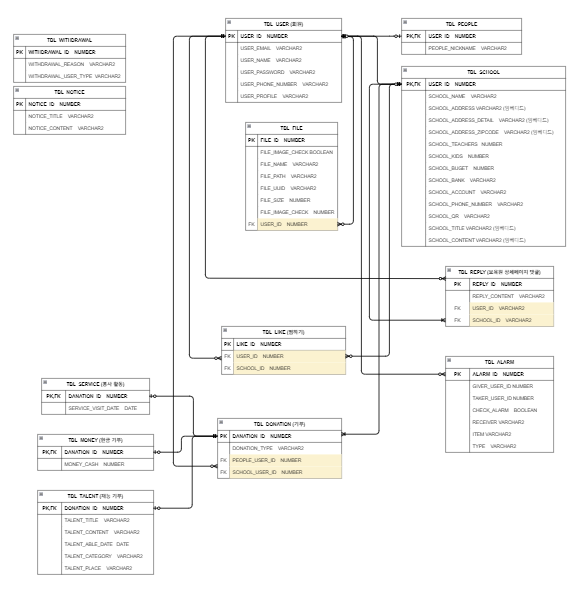

# 마일스톤(보육원 기부 활성화) 팀프로젝트입니다.

# 주제 선정이유 
저는 평소에 나눔에 관심이 있었고 실천하려 했습니다. 
하지만 그럴 때 마다 뉴스에서 자선사업회사들의 횡령 소식을 접하게 되었고 저는 나눔이라는 것이 꺼려지게 되었습니다.  
그러던 중 인터넷에서 보육원에 직접 쌀,생활 용품등을 전달하거나 햄버거,치킨,피자와 같은 배달음식을 주문하여 직접 보육원의 아이들과  
식사를 하는 게시물을 접하게 되었고 저는 직접하는 기부라면 안심하고 나눔을 실천할 수 있겠다고 생각하고 실천하기 위해 집 근처 보육원을 검색했습니다.  
하지만 검색한 보육원의 대한 정보는 이름과 위치 뿐이었습니다.  
정말 존재하는 보육원인지 아이들은 몇명인지 등의 정보를 알 수 없었고 보육원 나눔을 접어두었던 경험이 있습니다.  
그래서 이번 프로젝트에선 보육원에 대한 정보를 쉽게 얻고 더 나아가 기부를 더 쉽게 접근하게 하자는 목표로 주제를 선정했습니다. 
 
 
# 기획 
지역과 보육원이름으로 검색을 진행하여 보육원에 대한 정보를 쉽게 얻을 수 있게 하였습니다.  
랭킹시스템을 이용한 선의의 경쟁을 유도하여 도전의식과 성취감으로 누구나 쉽게 기부에 접근할 수 있게 하였습니다. 
각 보육원에 최근기부받은 내역을 추가하여 기부에 투명성을 높혔습니다. 
각 보육원마다 랭킹시스템이 따로 존재하여 기부를 많이 받지 못한 보육원랭킹에 쉽게 올라갈 수 있기 때문에 자연스레 기부를 많이 받지 못한 보육원에 기부를 할 수 있게 의도 하였습니다. 
기부금전달, 방문을 통한 배달또는 자원봉사등, 재능기부와 같은 다양한 기부형태를 제공하여 기부에 대한 접근성을 높혔습니다.  
기부시 상대측회원에 기부자의 정보가 알람으로 가게하여 보육원과 개인이 서로 연락을 주고받을 수 있게 하였습니다.  
좋아요 기능을 통해 관심있는 보육원을 저장하여 쉽게 확인할 수 있게 하였습니다.  
보육원상세페이지에 댓글을 주고 받으며 보육원과 더욱 쉽게 소통할 수 있게 하였습니다.  
 
 
# 퍼블리싱 
우선 최근 트렌드에 맞고 저희 사이트에 어울리는 참고할 사이트들을 수집하여 레이아웃을 구성했습니다.  
HTML, CSS, Java Script를 사용하여 작업했습니다. 
CSS의 가상요소와 Java Script의 다양한 이벤트를 통해 화면에 디자인을 했습니다. 미디어쿼리로 반응형 페이지를 구현했습니다. 
정규식을 이용하여 회원가입과 내정보 수정등에 유효성검사를 진행했습니다. 
 
 
# 설계 
joined 전략으로 Entity를 만들고 다른 테이블과 대부분 단방향 매핑을 하였지만 필요의 경우 양방향 매핑을 했습니다.  
임베디드를 만들어 공통요소를 묶고 Enum을 사용하여 오타의 위험을 줄였습니다. 
화면에서 사용될 값들로 DTO를 구성했습니다.  
3 Tier로 나누어 사용할 폴더와 파일을 미리 만들고 사용할 설정 파일을 만들었습니다. 
KakaoTalk_20221227_094840627
재능기부제목으로 검색 및 지역과 카테고리를 선택할 때 마다 쿼리가 달라져야 하기 때문에 Query Dsl의 동적쿼리로 구현했습니다.  
모든 페이지에서 동작해야하는 헤더의 알람과 프로필사진을 보여줘야하기 때문에 Interceptor를 이용하여 구현했습니다. 
구글 로그인 오어스 API를 사용하여 좀더 간편하게 회언가입 및 로그인을 할수 있게 구현하였습니. 
재능기부 글작성 및 마이페이지에서 수정 삭제를 만들어 CRUD를 구현하였습니다. 
 
 
# ERD

 
 
 
# 어려웠던 부분
- 처음에 팀의 팀장으로써 설계를 맡았는데 Springboot를 처음배우고 맡은 업무라 많은 어려움을 느끼고 해맸습니다.
- 하지만 강사님과 팀원들의 협력으로 설계를 마무리했고 튼튼한 설계와 기획으로 차질없이 백작업을 진행할수 있었습니다.
- AJAX와 동적쿼리등 제가 맡은 업무의 새로운 부분이라던가 처음 시도해보는 기술들이 많았지만 한두번 작업을 하다보니까 익숙해지고
- 어렵게 느꼇던 부분이 반복하다보니 쉬워져서 나중에는 오류와 버그 없이 제가 맡은 업무를 마무리 지을수 있었습니다.

# 문제를 해결했던 부분
- 기억에 남는 가장 시간을 오래잡았던 부분은 input date type을 하나 만들고 날짜를 정하면 DB에 값을 넣는부분이었는데
- DB에 local date time으로 지정을 해서 값이 잘 들어가지 않았습니다. 이부분을 구글링을 통해 열심히 공부를 하여서 값을 넣었을때
- 너무 기분이 좋았고 이부분이 가장기억에 남았습니다.

# 협업의 중요성
- 저희 팀은 다른팀들보다 2명~3명이 부족했던 터라 제가 팀장으로써 항상 협업과 서로의 희생정신이 중요하다 생각하여 팀들끼리 의견충돌과
- 힘듬이 있을때 항상 말을 들어주며 협업을 이끌어내여 마지막까지 다툼한번 없이 성공적으로 프로젝트를 마무리할수 있었습니다.
- 자바 첫 프로젝트때부터 기획과 소통 협업이 엄청 중요하다는것을 깨달아서 마지막 프로젝트까지 이부분을 가장 염두해두어서 좋은 결과를 만들었다고 생각합니다.

# 총평
- 개발이라는게 처음에는 너무 어색하고 어려운부분도 있지만 배우면 배울수록 재밌고 새로운 기술을 습득하고 사용할수록 나에게 오는 뿌듯함과
- 만족감이 너무 좋았던거 같습니다. 어려울꺼라 생각했던 부분도 하나하나 해결해나가는 개발이 점점 더 재밌어지는것 같습니다.

